# sciqisHomodyneTomography
Repo for Homodyne Tomography project in DTU course 10387 - Scientific computing in Quantum Information Science

Author: Bastian Valhøj

# Tomography
In Homodyne Tomography we want to construct a (usually unkown) continous-varriable state from measuring the quadrature $\hat{X}_\theta = \dfrac{1}{\sqrt{2}}\left(\hat{a}e^{i\theta} + \hat{a}^\dagger e^{i\theta}\right) \equiv \hat{X}\cos{\theta} + \hat{P}\sin{\theta}$, where $\theta$ denotes a rotation of the state in phase space.

This can be done if we can prepare the same unkown state many times and therefore measure the same state multiple times.

# Simulating samples

In this project we work with simulated data so that we can compare to the ground truth state.

In this part, the workflow is as follows:
- Create some known continous-variable state; gaussian or non-gaussian (e.g. cat a state: $\ket{\alpha} \pm \ket{-\alpha}$). Since we have numerics, the infinite hilbert space has to be truncated so we also choose some cutoff number $N_\mathrm{cut}$ for the representation.
- Construct the wigner function (we use `qutip`)
- Compute the marginal distributions $p(X_\theta)$ for a range of equidistant angles $\theta_j = n\pi/N,\quad n=0,\ \dots,\ N-1$
- For each of the $N$ marginals we sample values of $X_\theta$ corresponding to a measurement.
--------------------------------------------------

## The marginal distribution
The wigner function we wish to investigate is the coherent state with displacement $\alpha = 2+i$, and is shown in the figure below:

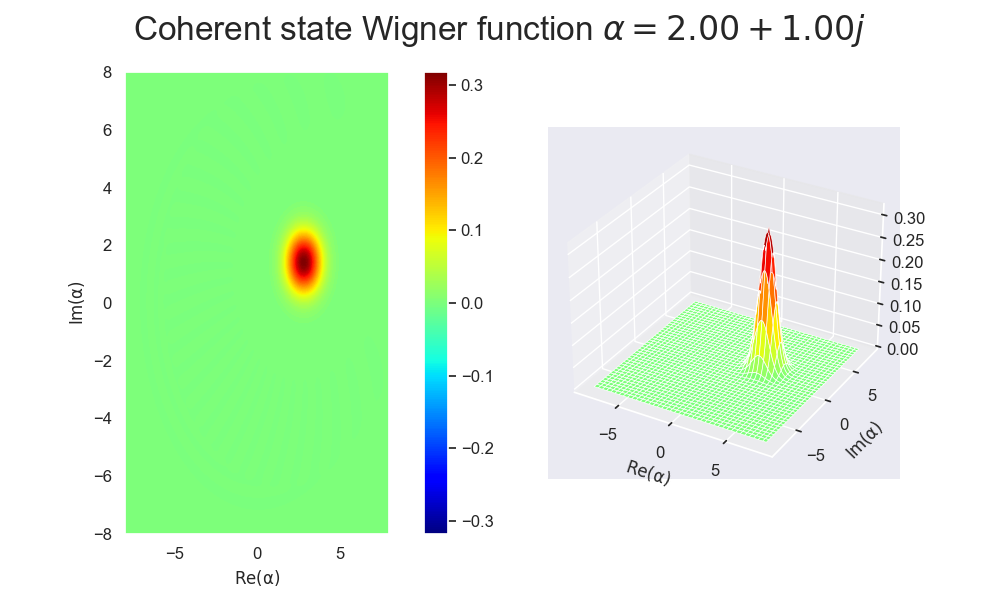

---------------------------------------------

From this Wigner function we can compute the marginals as $p(X) = \int dP W(X,P)$. Since we want to project the data onto the $X_\theta$ axis as shown in the figure here:
(from fig. 2. in [A. I. Lvovsky](https://journals.aps.org/rmp/abstract/10.1103/RevModPhys.81.299)) 

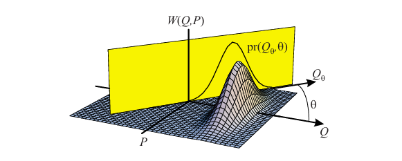


But we can just as easily rotate the whole Wigner function in the opposite direction (clockwise) and project the data onto $X$.

This can be done using the the unitary rotation operator 

$$
\begin{align}
    \hat{\rho} \rightarrow \hat{U}^\dagger(\theta)\hat{\rho}\hat{U}(\theta),\quad \mathrm{with}\quad \hat{U}(\theta)= e^{-i\theta \hat{n}}

\end{align}
$$

This is the rotation from $0\to \pi$ (counter-clockwise), but as explained earlier we want to rotate it in the opposite direction to project onto $X$, so we simply use $\hat{U}(\theta)\rho\hat{U}^\dagger(\theta)$, since $\hat{U}(-\theta) = \hat{U}^\dagger(\theta)$.

This is implemented as a simple function:
```python
import qutip as qt

def rotate_state(rho, theta):
    """Rotate the quantum state by an angle theta clockwise in phase-space."""
    rho = rho if rho.isoper else qt.ket2dm(rho) # Ensure rho is a density matrix
    N = rho.shape[0] # Dimension of the Hilbert space
    a = qt.destroy(N) # destruction operator
    U = (-1j*theta * a.dag() * a).expm() # rotation operator (clockwise)
    return U * rho * U.dag()
```
-----

To sample from these marginal distributions, we imploy a simple `numpy.choice`. 

Some of the resulting marginals and samples are shown in the figure:

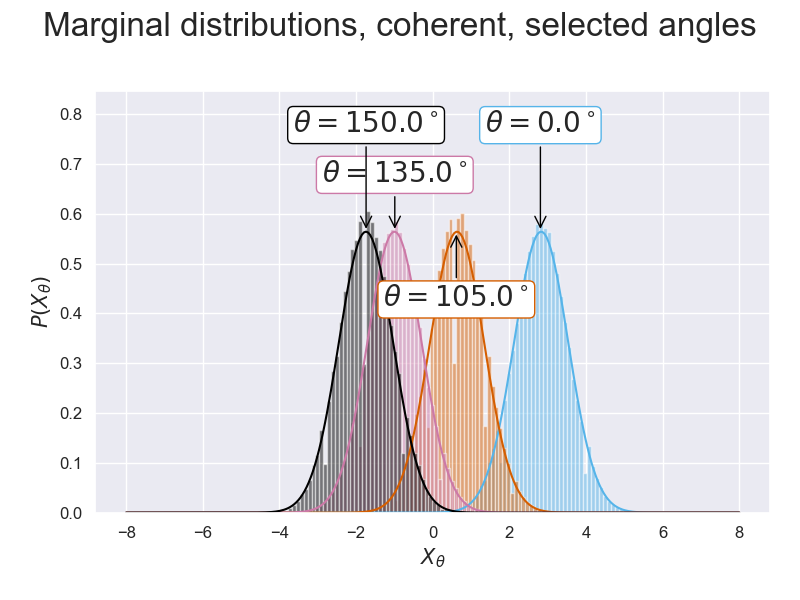


<!-- Finally we save the data using `numpy.save()` which can be loaded again as follows:

```python
import numpy as np

# save array T to key 'thetas' and array samples to key 'samples'
np.savez("measurements.npz", thetas=T, samples=samples)

# load data
data = np.load("measurements.npz")
# access arrays as a dictionary
loaded_theta = data["thetas"]
loeaded_samples = data["samples"]
``` -->

It is wort noting that when using choice sampling we need a probability of outcome $X_\theta$, but the marginals $p(X_\theta)$ is a *probability density*. Meaning the probability of outcome $j$ is the integral is approximated as $p(X_\theta = j) = p(X_\theta)dP_\theta$ 


<!-- All these calculations are available in the notebook [generateState.ipynb](HomoTomo/generateState.ipynb) -->

# Reconstruction

The workflow is as follows:
- Read dataset and ground truth state (was saved in the notebook [generateState.ipynb](HomoTomo/generateState.ipynb))
- For each angle we bin the measurements and count the amount in each bin
- *"Guess"* on a cutoff size for the Hilbert space, $N_\mathrm{cut}$
- Optimize density matrix by the log-likelihood
- Compute the Wigner function and compare to ground truth

---------------------

For reconstruction of the Wigner function from the dataset $\mathcal{D}(X_\theta, \theta)$ containing samples, we use the iterative maximum-likelihood method described in: [A. I. Lvovsky 2004, J. Opt. B: Quantum Semiclass. Opt. 6 S556](https://iopscience.iop.org/article/10.1088/1464-4266/6/6/014). 

We will for the most part use the same notation as in the article.

The likelihood of the state being in $\hat{\rho}$ is given by

$$
\begin{align}
    \mathcal{L}(\hat{\rho}) = \prod_j p(X_j,\theta_j \vert \hat{\rho})^{f(X_j,\theta_j)}

\end{align}
$$
Here $j$ signifies the $j$'th bin of data for some angle $\theta$, $p_\rho(j)$ is the probability of a measurement being in said bin for a density matrix $\rho$, and $f_j$ is the *frequency* of measurements in bin $j$, or how many measurements are in the bin.

We want to determmine the optimal density matrix, $\hat{\rho}_\mathrm{opt}$, which maximizes the likelihood.

We can iterate the density matrix by

$$
\begin{align}
    \hat{\rho}^{(k+1)} &= \dfrac{\hat{R}\hat{\rho}^{(k)}\hat{R}}{\mathrm{Tr}\left[\hat{R}\hat{\rho}^{(k)}\hat{R}\right]} 
    \\
    \hat{R} = \hat{R}(\hat{\rho}) &= \sum_j\dfrac{f(X_j,\theta_j)}{p(X_j,\theta_j\vert \hat{\rho})}\Pi_{nm}(X_j,\theta_j), \\
     \Pi_{nm}(X,\theta) &= \langle n \vert X,\theta \rangle \langle X,\theta \vert m \rangle
\end{align}
$$

with $\langle n \vert X,\theta\rangle = e^{in\theta}\langle  n\vert X, 0\rangle =  e^{in\theta}\psi_n(X)$ and $\Pi_{nm}(X,\theta)$ being the projection of the quadrature onto the Fock state, which has a well-defined solution for a harmonic potential and can be looked up online as:

$$
\begin{align}
    \psi_n(x) = \left(\dfrac{2}{\pi}\right)^{1/4} \dfrac{H_n(\sqrt{2}x)}{\sqrt{2^n n!}}e^{-x^2}
\end{align}
$$

When implementing eq. (6) we will create a state $\ket{\psi_n}$ which is a vector of length $N_\mathrm{cut}$, and compute the projection operator $\Pi_{nm}(j)$ for each value of $(X_j,\theta_j)$ and then sum over all $\Pi_{nm}$ of size $(N_\mathrm{cut}\times N_\mathrm{cut})$ calculating $\hat{R}$ in eq. (5).

----

### Implementation

Updating the density matrix:
$
\hat{\rho}^{(k+1)} = \dfrac{\hat{R}\hat{\rho}^{(k)}\hat{R}}{\mathrm{Tr}\left[\hat{R}\hat{\rho}^{(k)}\hat{R}\right]} 
$

```python
import qutip as qt

def update_density_matrix(rho : qt.Qobj, R: qt.Qobj) -> qt.Qobj:
    """Update the density matrix using the MLE formula."""
    updated_rho = R * rho * R
    updated_rho = updated_rho / updated_rho.tr()  # Normalize the updated density matrix to unit trace
    return updated_rho
```

Computing the wave function: $\langle n \vert X,\theta\rangle = e^{in\theta}\psi_n(x)$

```python
from scipy.special import factorial, hermite
import numpy as np

def SE_sol(x, theta, n):
    """Calculate the wavefunction for a given angle theta and Fock state n."""
    Hn = lambda x: hermite(n)(x)
    psi_n =  (2/np.pi)**0.25 / np.sqrt(2**n * factorial(n)) * Hn(x) * np.exp(-x**2 / 2) 
    return np.exp(1j * n * theta) * psi_n

def wavefunction_per_theta(bin_centers, theta, N_cutoff):
    """Calculate the wavefunction for a single angle theta."""
    M = len(bin_centers)
    wf = np.zeros(shape=(M, N_cutoff), dtype=np.complex128)  # shape (M, N_cutoff)
    for n in range(N_cutoff):
        wf[:, n] = SE_sol(bin_centers, theta, n)
    return wf
```


Computing the MLE iteratively is shown here as snippet:

```python
# compute all wavefunctions needed
psi = [wavefunction_per_theta(bin_centers, theta, N_cut) for theta in theta_list]
# initialize R and rho
R = qt.Qobj(np.zeros((N_cut, N_cut)))
rho = qt.qeye(N_cut).unit() # normalized identity
for i, theta in enumerate(theta_list): # iterate thetas 
    for k, count, in enumerate(sinogram[i, :]): # iterate bins
        psi = psi[theta][k]
        projection = psi.proj()
        prob = (projection * rho).tr() # probability
        R += count*projection/prob
    # after R is summed we update rho
    rho = update_rho(rho, R)
```


### The results

The evoltution of the Wigner function is shown here in the gif:


To easily determine the change we can look at a subset of the iterations and the ground truth:

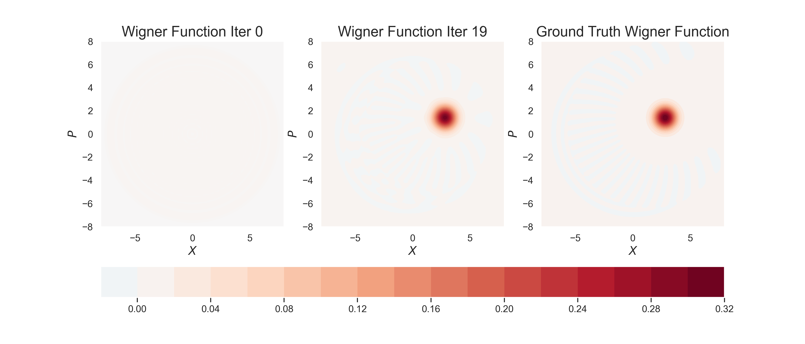

And the density matrix:

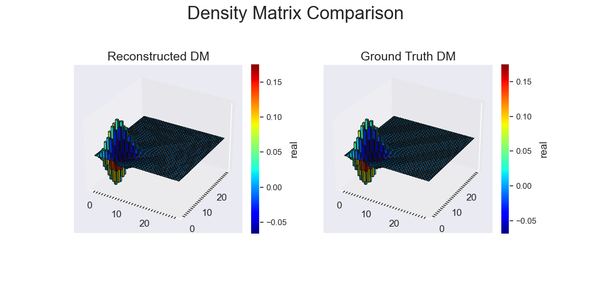


All these calculations are available in the notebook [reconstruct.ipynb](HomoTomo/reconstruct.ipynb)

## Reconstruction for a cat state

Now we show the results for an even cat state: $\ket{\alpha} + \ket{\alpha}$ with $\alpha = 2+i$ as before.

Here is the expected output (ground truth):

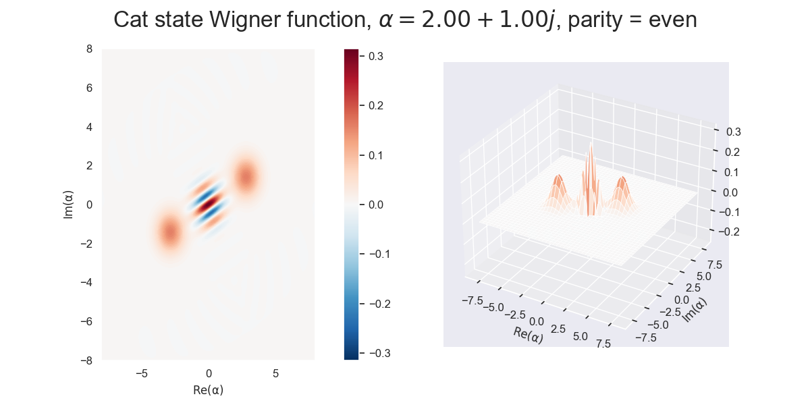


And plotting the marginals and sampling for some angles:

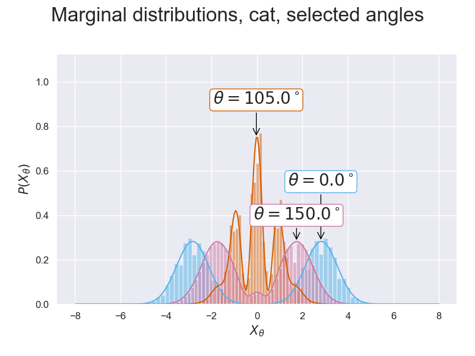


The evoltution of the Wigner function is shown here in the gif:

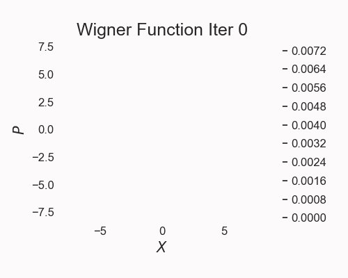


To easily determine the change we can look at a subset of the iterations and the ground truth:

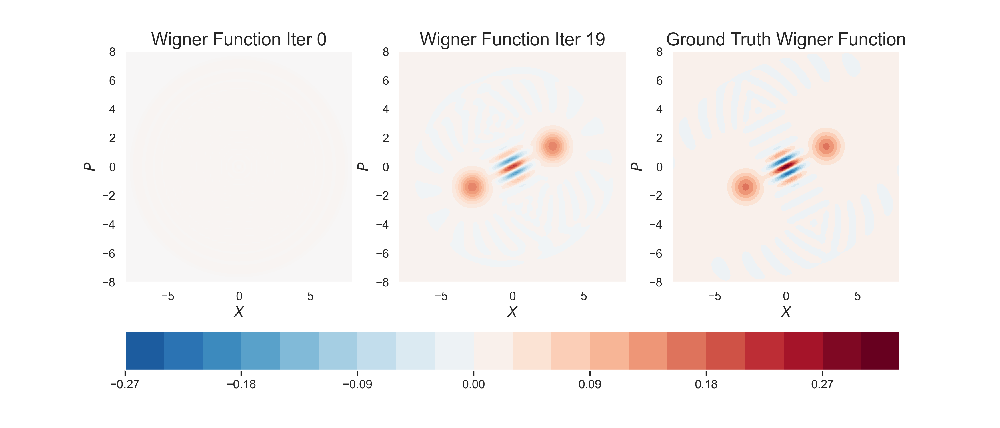

And the density matrix:

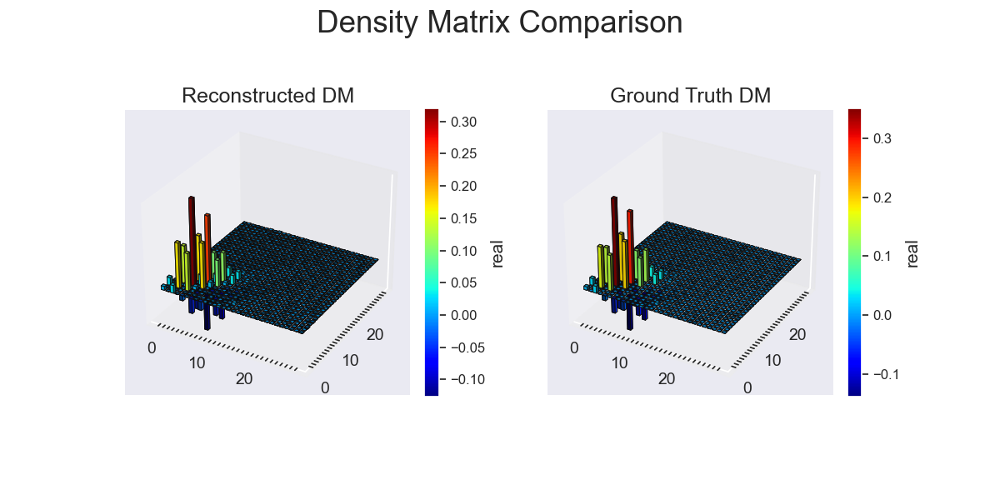


# Further progress

If time would permit we would improve on the sampling of data, and determine why the log-likelihodds do not converge.

Choice sampling uses sampling from the marginal, $p(x)$, and proposal distribution, $q(x)$. Then a uniform number in the interval $u \in [0,1)$ is generated and if $up(x) < q(x)$ we accempt the sample, otherwise reject.  
This proved to be difficult to implement for non-gaussian states especially. It is also much slower than simply using choice-sampling.

 
Additionally the log-likelihoods was never the reason for convergence:

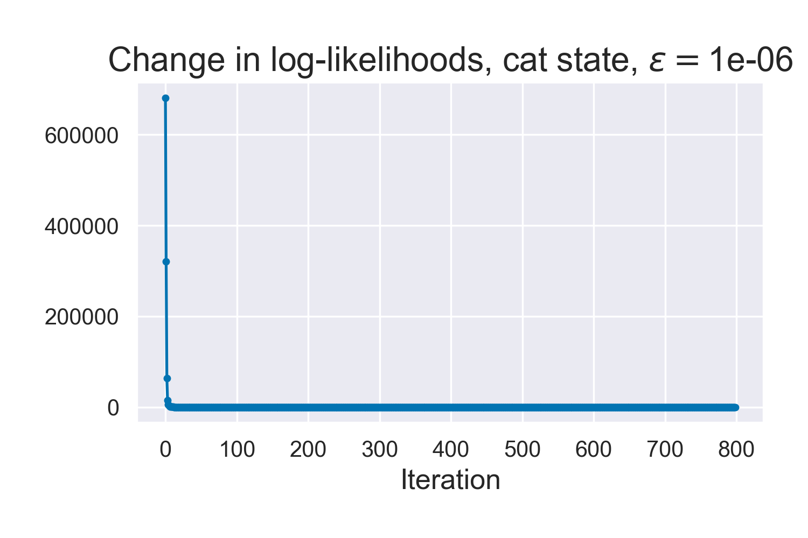