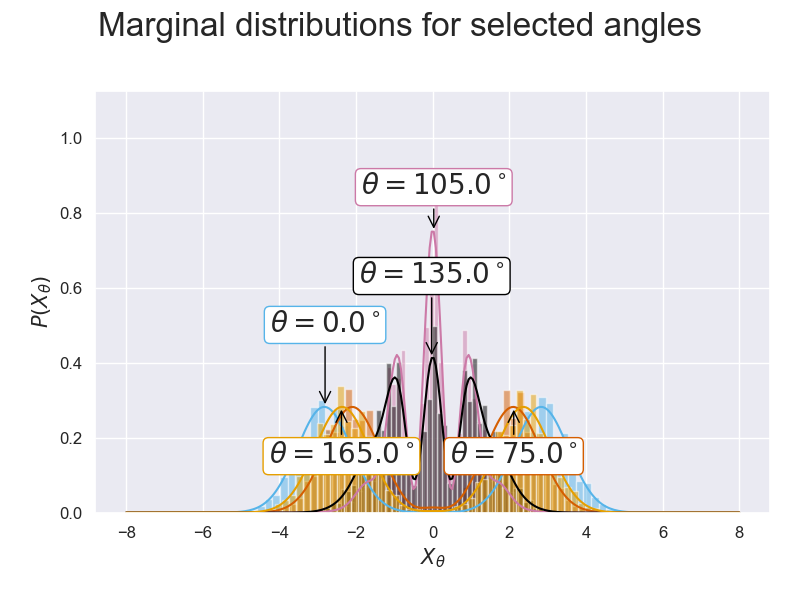

# sciqisHomodyneTomography
Repo for Homodyne Tomography project in DTU course 10387 - Scientific computing in Quantum Information Science

# Tomography
In Homodyne Tomography we want to construct a (usually unkown) continous-varriable state from measuring the quadrature $X_\theta = \dfrac{1}{\sqrt{2}}\left(\hat{a}e^{i\theta} + \hat{a}^\dagger e^{i\theta}\right)$, where $\theta$ denotes a rotation of the state in phase space.

This can be done if we can prepare the same unkown state many times and therefore measure the same state multiple times.

# Simulating samples

In this project we work with simulated data so that we can compare to the ground truth state.

In this part, the workflow is as follows:
- Create some known continous-variable state; gaussian or non-gaussian (e.g. cat a state: $\ket{\alpha} \pm \ket{-\alpha}$). Since we have numerics, the infinite hilbert space has to be truncated so we also choose some cutoff number $N_\mathrm{cut}$ for the representation.
- Construct the wigner function (we use `qutip`)
- Compute the marginal distributions $p(X_\theta)$ for a range of equidistant angles $\theta_j = n\pi/N,\quad n=0,\ \dots,\ N-1$
- For each of the $N$ marginals we sample values of $X_\theta$ corresponding to a measurement.

## The marginal distribution
The wigner function we wish to investigate is the coherent state with displacement $\alpha = 2+i$, and is shown in the figure below:

From this we can compute the marginals as $p(X) = \int dp W(X,p)$, but this would only project onto the $\hat{X}$ quadrature, and since we want for a range of angles we can simply rotate the quadrature with some angle $\theta$. This is defined by $X_\theta = \hat{U}^\dagger(\theta)\hat{X}\hat{U}(\theta)$, with $\hat{U}(\theta) = e^{-i\theta \hat{n}}$. 

**NOTE**: This gives a rotation from $0\to\pi$ but for our purpose we want to compute the integral along the $x$-axis, and therefore we need to rotate $0\to-\pi$ which we implement by using $X_\theta \leftarrow \hat{U}(\theta)\hat{X}\hat{U}^\dagger(\theta) \equiv \hat{U}^\dagger(-\theta)\hat{X}\hat{U}(-\theta)$

The figure below illustrates how the marginals project the function along to a new axis $X_\theta$ ($Q_\theta$ in the figure)

(from fig. 2. in [A. I. Lvovsky](https://journals.aps.org/rmp/abstract/10.1103/RevModPhys.81.299)): 

To recap:  
The marginal distribution for $X_\theta$ is 
$$
    p(X_\theta) = \int dp_\theta W(X_\theta,P_\theta)
$$

To sample from these marginal distributions, we imploy a simple `numpy.choice` and the resulting marginals and samples are shown in the figure:

